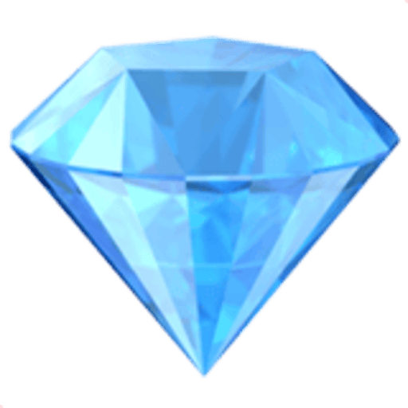

# 💎✨ International Jewelry Box ✨💎

<p align="center">
  <strong>Translation, but beautiful.</strong><br/>
  Neon styling • floating gems • voice tools • saved phrases • playful utility magic
</p>

<p align="center">
  
</p>

<p align="center">
  
  
  
  
</p>

---

## 🌐 Live Site

**Open the app here:**  
https://dacameragirl.github.io/international-jewelry-box/

---

## 🌌 About the Project

**International Jewelry Box** is a growing collection of creative micro-tools designed to make everyday digital tasks feel more polished, expressive, and visually alive.

The first live compartment is **Translation Gem**, a browser-based translation tool wrapped in a neon jewel-box interface with glowing panels, floating gem motion, speech features, local saved phrases, and multiple visual themes.

It is practical, but not boring. Because apparently even utilities deserve better than looking like a tax form from 2006. 💅

---

## 💠 Current Compartment: Translation Gem

**Translation Gem** is the active tool in this repository today. It focuses on fast, browser-based translation with an interface that feels more playful and luxurious than a plain form-and-button translator.

The app currently runs as a fully client-side web project using HTML, CSS, and JavaScript. It includes browser speech tools, local saved entries, theme options, and a PWA shell for installable app behavior.

---

## ✨ What Is Built Now

- 💎 **26 target languages**
- 🌍 **source-language auto-detection**
- ⚡ **live translation after a short pause**
- 📋 **copy-to-clipboard support**
- 🕘 **recent translation history stored locally**
- ⭐ **favorites stored locally**
- 🔊 **browser text-to-speech for source and translated text**
- 🎙️ **browser voice input where speech recognition is supported**
- 🎨 **multiple visual themes, including light mode**
- 📱 **installable PWA shell**
- 📴 **offline access to the app shell and saved entries**
- ✨ **floating gem visuals and neon UI styling**

---

## 🧠 Honest Notes

This project is beautiful, but it is not pretending to be enterprise infrastructure yet. We are sparkly, not delusional. ✨

- Fresh translations still require a network connection.
- Translation currently depends on public endpoints, so long-term reliability is not guaranteed yet.
- Voice input and speech playback depend on browser support.
- The project is currently fully client-side and does not use a private backend.

For stronger production reliability later, the next major upgrade is moving translation calls behind a small serverless proxy connected to a dedicated translation API.

---

## 🌍 Supported Languages

Translation Gem currently supports these target languages:

- Arabic
- Chinese
- Czech
- Dutch
- English
- Filipino
- French
- German
- Greek
- Hebrew
- Hindi
- Hungarian
- Indonesian
- Italian
- Japanese
- Korean
- Polish
- Portuguese
- Romanian
- Russian
- Spanish
- Swedish
- Thai
- Turkish
- Ukrainian
- Vietnamese

**Total supported target languages: 26**

---

## 🧩 Project Structure

```text
international-jewelry-box/
├── index.html        # Main app interface, translation UI, themes, and client-side logic
├── manifest.json     # Progressive Web App configuration
├── sw.js             # Service worker for offline shell support
├── icon-192.png      # PWA icon
├── icon-512.png      # Large PWA icon
└── README.md         # Project documentation
```

---

## 🛠️ Technology Stack

- **HTML5** for app structure
- **CSS3** for neon styling, responsive layout, themes, and animation
- **JavaScript** for translation behavior, browser APIs, local storage, and interaction
- **Progressive Web App files** for installable app support

---

## 🚀 Local Development

Clone the repository:

```bash
git clone https://github.com/DaCameraGirl/international-jewelry-box.git
```

Open the project folder:

```bash
cd international-jewelry-box
```

Open `index.html` directly in a browser, or serve the folder locally:

```bash
npx serve .
```

No heavy build step required. The web has suffered enough. 🫠

---

## 💠 Roadmap

### High Priority

- Replace public translation endpoints with a more reliable low-cost API path.
- Improve accessibility for contrast, focus states, readable motion, and keyboard flow.
- Tighten mobile behavior and overall UX polish.

### Medium Priority

- Improve pronunciation and language-specific speech handling.
- Add better export and sharing options for saved translations.
- Expand the Jewelry Box with more standalone compartments.
- Add copy, clear, save, and favorite flows with stronger feedback states.

### Lower Priority

- Add more theme packs and gem-inspired visual variants.
- Add richer animation passes where they help rather than distract.
- Add decorative sparkle controls for users who want more glow or less chaos.

---

## 🌟 Future Compartment Ideas

Potential future tools may include:

- 💱 **Currency Gem** — quick currency conversion
- 🧳 **Phrase Gem** — travel phrase helper
- 🎨 **Palette Gem** — color palette generator
- ✍️ **Quote Gem** — styled quote creator
- 🔤 **Name Gem** — name meaning or cultural name explorer
- 🖼️ **Export Gem** — convert styled text into shareable images
- ✨ **Sparkle Gem** — decorative text and visual effect generator

---

## 🏷️ GitHub Label Guide

Suggested issue labels for keeping the project board organized:

- `gem: idea` — new compartment or feature idea
- `gem: translation` — translation feature work
- `gem: design` — UI, motion, themes, layout, and visual polish
- `gem: pwa` — offline support, installability, manifest, and service worker
- `gem: accessibility` — contrast, keyboard flow, legibility, and inclusive UX
- `gem: content` — README, copywriting, docs, and supported language notes
- `gem: bug` — broken behavior
- `gem: polish` — smaller refinements and cleanup
- `priority: high` — important and should happen soon
- `priority: medium` — useful but not urgent
- `priority: low` — nice sparkle, not critical
- `status: blocked` — waiting on something else
- `status: ready` — ready to build
- `good first gem` — beginner-friendly contribution

---

## 🤝 Contributing

Contributions are welcome, especially in these areas:

- Translation reliability
- Visual refinement
- Mobile polish
- Accessibility improvements
- New jewelry box compartments
- Documentation cleanup
- PWA and offline behavior improvements

Open an issue or submit a pull request with a clear description of the proposed change.

---

## 📜 License

MIT License

Free to use, remix, modify, and build upon.

---

## 💬 Author

**Angela Hudson**  
Also known as **DaCameraGirl**

Creative technologist, visual storyteller, neon-aesthetic enthusiast, and builder of beautiful digital tools. 💎✨

---

## 💖 Project Status

**International Jewelry Box** is in active development.

The first compartment, **Translation Gem**, is live now. More polish, stronger translation reliability, additional compartments, and extra sparkle are planned as the jewelry box continues to grow.
